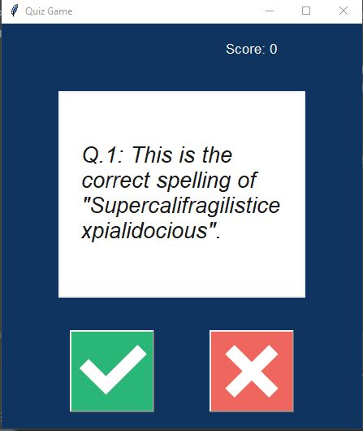

# The Quiz Game

The Quiz Game is a small game the test your knowledge about computer science by asking you several questions on the field, 
and you can answer by "True" or "False".

## The Game Looks:

